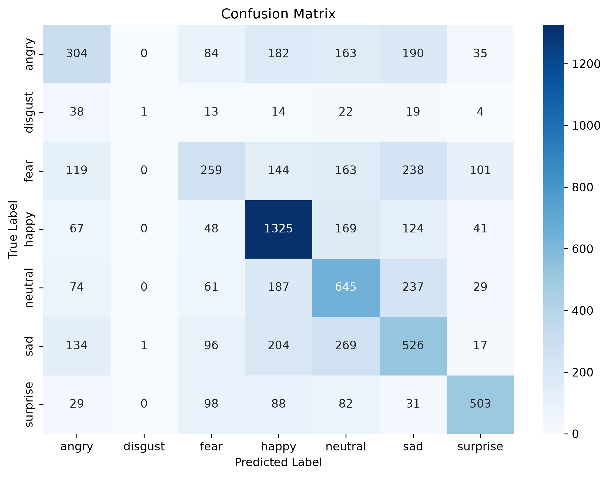
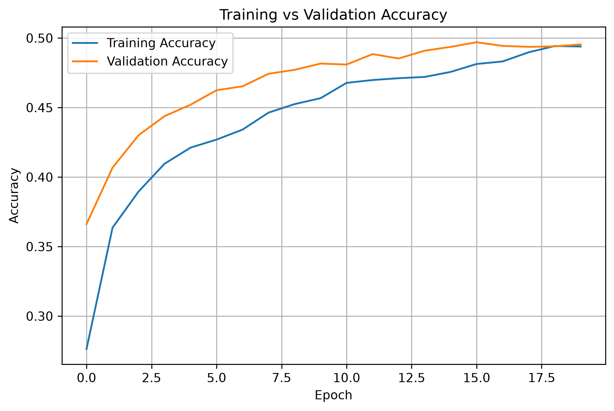
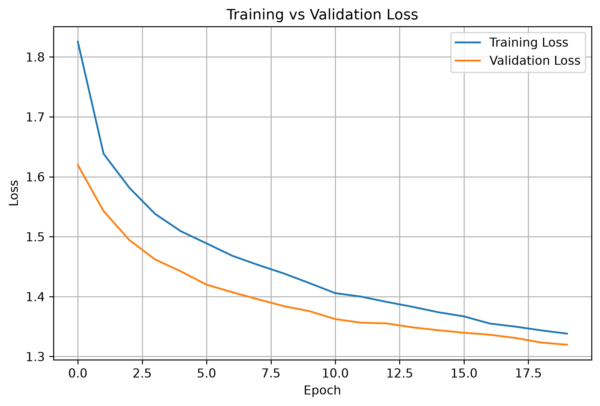
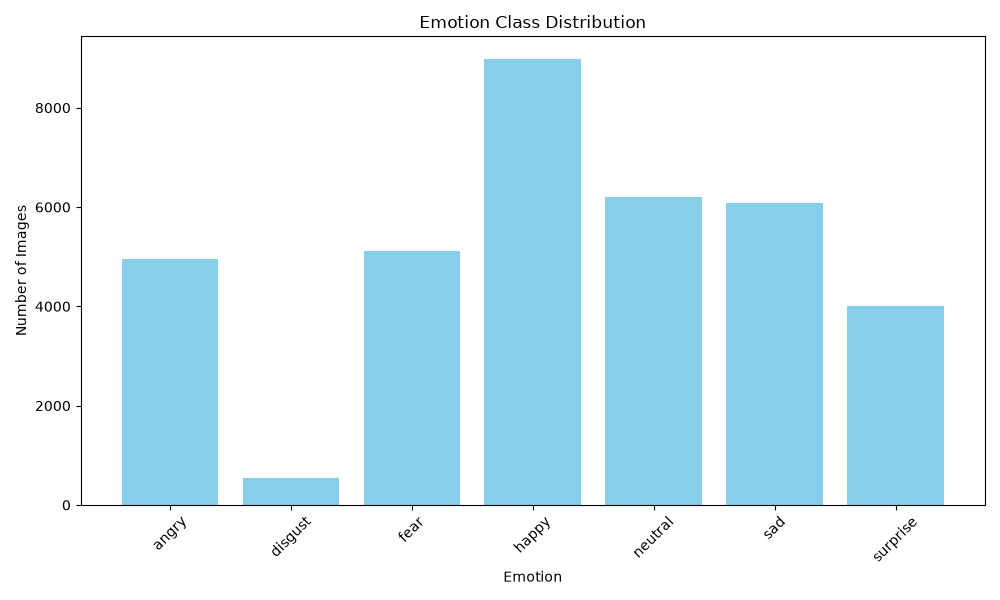
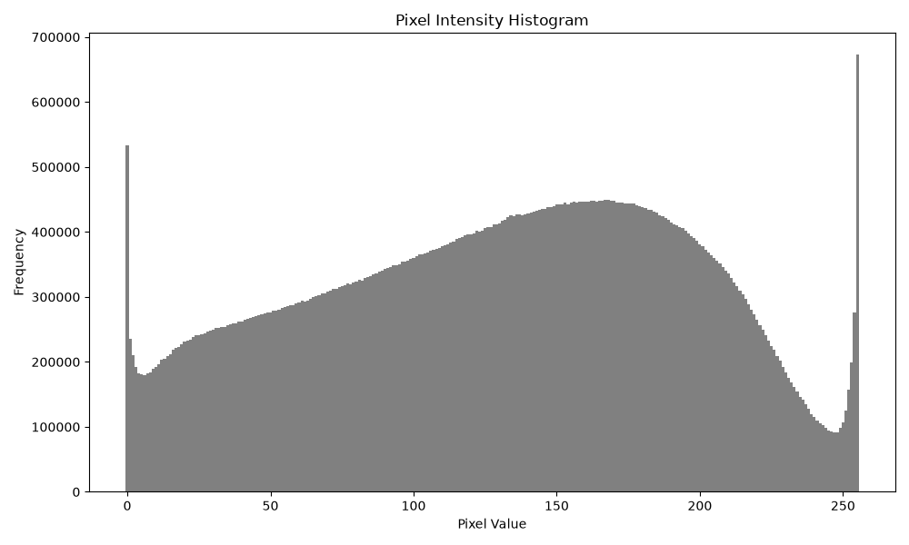

# DeepFER - Facial Emotion Recognition Using Deep Learning

DeepFER is a facial emotion recognition system built using **TensorFlow**, **Keras**, **MobileNetV2**, and **OpenCV**. The project demonstrates the complete deep learning workflow, including dataset preprocessing, transfer learning, model training, evaluation, image prediction, and real-time webcam-based emotion recognition.

The model is trained on the **FER2013** dataset and can classify facial expressions into seven emotions.

---

## Features

- Dataset analysis and visualization
- Data preprocessing pipeline for FER2013
- Transfer Learning using MobileNetV2
- Model training with callbacks
- Automatic model checkpoint saving
- Performance evaluation
- Classification report generation
- Confusion matrix visualization
- Single image emotion prediction
- Real-time webcam emotion detection
- Training accuracy and loss visualization

---

## Emotion Classes

The model predicts the following seven emotions:

- Angry
- Disgust
- Fear
- Happy
- Neutral
- Sad
- Surprise

---

## Project Structure

```
DeepFER/
│
├── assets/
│   └── demo/
│
├── dataset/
│   ├── train/
│   └── test/
│
├── docs/
│
├── models/
│   ├── checkpoints/
│   └── trained_models/
│
├── outputs/
│   ├── evaluation/
│   ├── logs/
│   ├── plots/
│   └── predictions/
│
├── src/
│   ├── preprocess.py
│   ├── model.py
│   ├── train.py
│   ├── evaluate.py
│   ├── predict.py
│   ├── webcam.py
│   └── utils.py
│
├── requirements.txt
├── README.md
├── LICENSE
└── .gitignore
```

---

## Dataset

This project uses the **FER2013** facial expression dataset.

Dataset characteristics:

- Grayscale facial images
- Image size: **48 × 48**
- Seven emotion classes
- Suitable for academic research and learning purposes

---

## Model Architecture

The project uses **Transfer Learning** with MobileNetV2.

```
Input Image (224 × 224 × 3)
            │
            ▼
Pretrained MobileNetV2
(Frozen Feature Extractor)
            │
            ▼
Global Average Pooling
            │
            ▼
Dropout (0.3)
            │
            ▼
Dense (128, ReLU)
            │
            ▼
Dropout (0.3)
            │
            ▼
Dense (7, Softmax)
```

---

## Data Preprocessing

Training images undergo the following preprocessing pipeline:

```
48 × 48 Grayscale Image
        │
        ▼
Resize to 224 × 224
        │
        ▼
Convert Grayscale → RGB
        │
        ▼
MobileNetV2 Preprocessing
        │
        ▼
Model Input
```

For inference (image prediction and webcam), RGB images are converted to match the FER2013 training format before prediction.

---

## Training Configuration

| Parameter | Value |
|-----------|------:|
| Backbone | MobileNetV2 |
| Optimizer | Adam |
| Learning Rate | 1e-6 |
| Epochs | 20 |
| Batch Size | 32 |
| Loss Function | Sparse Categorical Crossentropy |
| Early Stopping | Enabled |
| Reduce LR on Plateau | Enabled |
| Model Checkpoint | Enabled |

---

## Generated Outputs

After training and evaluation, the project generates:

### Evaluation

- #### Confusion Matrix

<p align="center">

</p>

- #### Classification Report

```text
              precision    recall  f1-score   support

angry           0.3974     0.3173     0.3529        958
disgust         0.5000     0.0090     0.0177        111
fear            0.3930     0.2529     0.3078       1024
happy           0.6180     0.7469     0.6764       1774
neutral         0.4263     0.5231     0.4698       1233
sad             0.3853     0.4218     0.4028       1247
surprise        0.6890     0.6053     0.6445        831

------------------------------------------------------------

Accuracy                               0.4964       7178

Macro Average    0.4870     0.4109     0.4102       7178

Weighted Average 0.4895     0.4964     0.4837       7178
```
- #### Evaluation Summary

```text
Test Accuracy: 0.4964
Test Loss: 1.3238

Precision:    0.4870
Recall:       0.4109
F1-Score:     0.4102
```
### Training Plots

#### Training Accuracy

<p align="center">

</p>

---

#### Training Loss

<p align="center">

</p>

---


#### Dataset Distribution

<p align="center">

</p>

---

#### Pixel Intensity Distribution

<p align="center">

</p>

---

## Running the Project

### 1. Install dependencies

```bash
pip install -r requirements.txt
```

---

### 2. Train the model

```bash
python src/train.py
```

---

### 3. Evaluate the trained model

```bash
python src/evaluate.py
```

---

### 4. Predict emotion from an image

Update the image path inside `predict.py` if required.

```bash
python src/predict.py
```

---

### 5. Real-time webcam prediction

```bash
python src/webcam.py
```

Press **Q** or **Esc** to exit the webcam window.

---

## Results

The trained model is capable of recognizing facial expressions from both static images and webcam input.

Generated evaluation artifacts include:

- Classification Report
- Confusion Matrix
- Accuracy Curves
- Loss Curves

---

## Technologies Used

- Python
- TensorFlow
- Keras
- OpenCV
- NumPy
- Matplotlib
- Scikit-learn

---

# Important Notes ⚠️

## This is a demonstration project

This project is intended to demonstrate the implementation of a complete facial emotion recognition pipeline using deep learning. It is **not designed as a production-ready facial emotion recognition system**.

---

## FER2013 Dataset Limitations

The model is trained on the FER2013 dataset, which contains:

- Low-resolution (48×48) grayscale images
- Primarily posed facial expressions
- Limited diversity compared to modern datasets

As a result, the model performs better on exaggerated expressions than subtle, real-world facial emotions.

---

## Real-world Performance

Real-world webcam images differ significantly from FER2013 images in terms of:

- Lighting conditions
- Camera quality
- Facial pose
- Expression intensity
- Image resolution

Therefore, predictions on live webcam input may not always be accurate.

---

## Educational Purpose

This repository is intended for:

- Learning Deep Learning
- Understanding Transfer Learning
- Exploring TensorFlow workflows
- Academic projects
- Internship demonstrations

It should not be used for applications requiring reliable or safety-critical emotion recognition.

---

## Future Improvements

Possible enhancements include:

- Training on larger real-world datasets such as AffectNet or RAF-DB
- Fine-tuning MobileNetV2 instead of freezing the backbone
- Better face detection using MediaPipe or RetinaFace
- Temporal smoothing for webcam predictions
- Improved data augmentation
- Higher-resolution training images

---

## License

This project is released under the MIT License.

---

## Author

**Dhiman Nath**

If you found this project useful, consider giving it a ⭐ on GitHub.